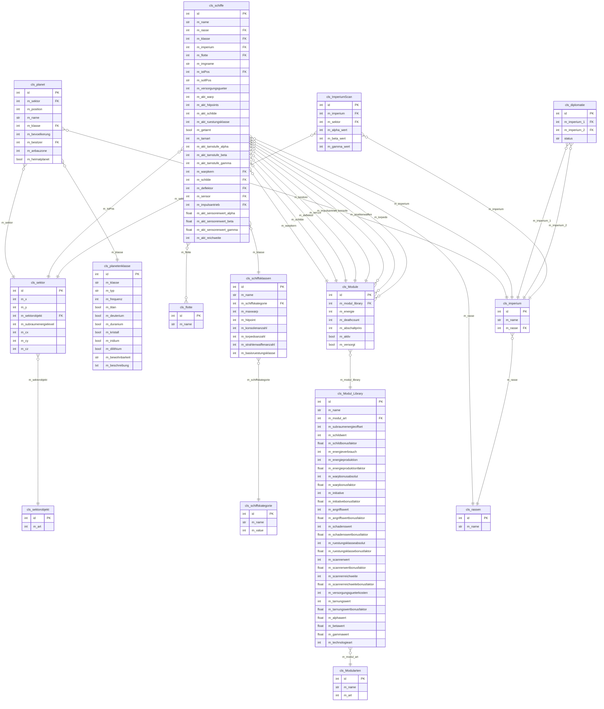

# ER-Diagramm: Star Trek Django Projekt

## Übersicht der Tabellen und Beziehungen

## Kurzübersicht der Beziehungen

| Von | Zu | Beziehung |
|-----|-----|-----------|
| cls_sektor | cls_sektorobjekt | 1:1 (jeder Sektor hat max. 1 Sektorobjekt) |
| cls_planet | cls_sektor | N:1 (mehrere Planeten pro Sektor) |
| cls_planet | cls_planetenklasse | N:1 |
| cls_planet | cls_imperium | N:1 (Besitzer) |
| cls_schiffe | cls_rassen | N:1 |
| cls_schiffe | cls_schiffsklassen | N:1 |
| cls_schiffe | cls_imperium | N:1 |
| cls_schiffe | cls_flotte | N:1 (oder null) |
| cls_schiffe | cls_sektor (istPos) | N:1 (aktueller Standort) |
| cls_schiffe | cls_Module | N:1 (warpkern, schilde, deflektor, sensor, impulsantrieb) |
| cls_schiffe | cls_Module | N:M (konsole, strahlenwaffen, torpedo) |
| cls_schiffsklassen | cls_schiffskategorie | N:1 |
| cls_Module | cls_Modul_Library | N:1 |
| cls_Modul_Library | cls_Modularten | N:1 |
| cls_imperium | cls_rassen | N:1 |
| cls_diplomatie | cls_imperium | N:2 (Beziehung zwischen 2 Imperien) |
| cls_ImperiumScan | cls_imperium | N:1 |
| cls_ImperiumScan | cls_sektor | N:1 |

## Farbcodierung nach Apps

- 🔵 **karte** (Blau): cls_sektor, cls_sektorobjekt
- 🟢 **planet** (Grün): cls_planet, cls_planetenklasse
- 🟠 **schiffe** (Orange): cls_flotte, cls_schiffe, cls_schiffskategorie, cls_schiffsklassen
- 🟣 **module** (Lila): cls_Modularten, cls_Modul_Library, cls_Module
- 🔴 **imperium** (Rot): cls_rassen, cls_imperium, cls_diplomatie, cls_ImperiumScan

